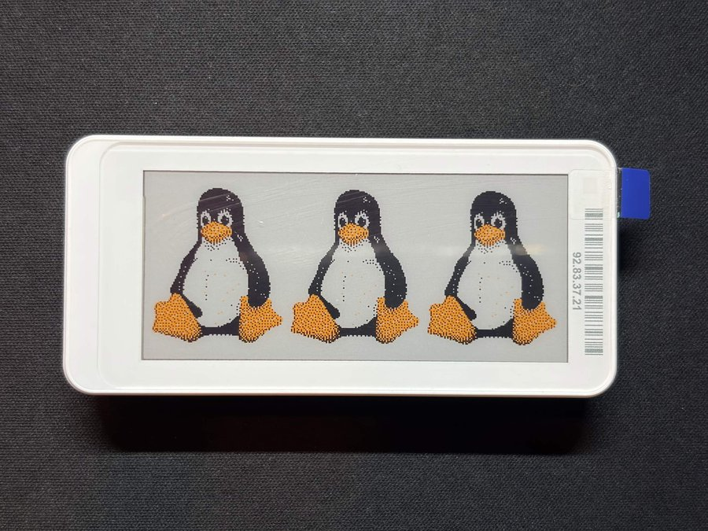
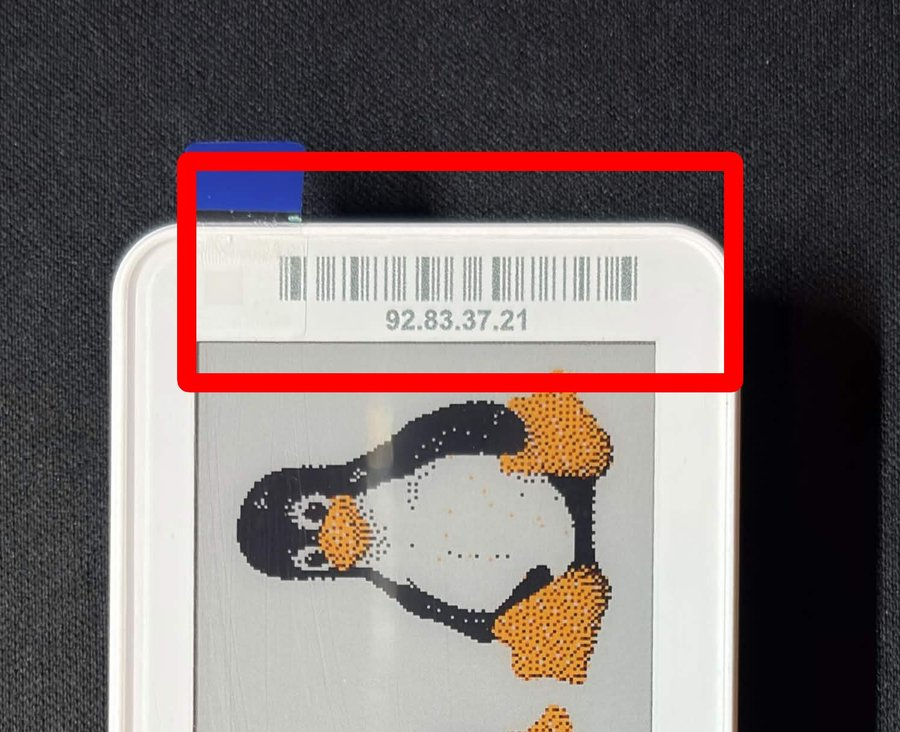

# gicisky-296-bwry



A small Python library and BLE driver for the Gicisky/PICKSMART 2.9" 296x128
BWRY (black/white/red/yellow) e-paper display (device type `0x002E`).

## Install

```bash
pip install -e .
```

## Usage

```python
import asyncio
from PIL import Image
from gicisky_296_bwry import GiciskyTag


async def main():
    image = Image.open("status.png")  # must be 296x128 RGB

    async with GiciskyTag("AA:BB:CC:DD:EE:FF") as tag:
        await tag.display(image)


asyncio.run(main())
```

See `examples/display_test_image.py` for a runnable four-colour test pattern,
`examples/display_tux.py` for a Tux (`examples/assets/tux.png`) sample that
tiles the mascot three times across the panel, or `examples/display_photo.py`
to fit/quantize any arbitrary photo onto the panel.

## Error handling

Failures raise `GiciskyError` subclasses (`GiciskyConnectionError`,
`GiciskyProtocolError`, `GiciskyTransferError`); a failed or cancelled
`upload()` disconnects, so call `connect()` again before retrying.

Timeouts and retry limits are configurable via `GiciskyTag` keyword
arguments, e.g. `GiciskyTag(address, transfer_timeout=60, max_retries=5)`.

## Finding your tag's BLE address

Each tag advertises over BLE and has its address printed on a label next to a
barcode near the connector edge (the last four octets, e.g. `92.83.37.21`,
are printed there):



To find the full address (`XX:XX:92:83:37:21`) for use with this library,
scan for nearby BLE devices:

```bash
bluetoothctl scan on
```

Look for a device named like `NEMR92833721` (the digits match the ones
printed on the label). Press <kbd>Ctrl+C</kbd> or run `bluetoothctl scan off`
once you've found it, then use the full `XX:XX:XX:XX:XX:XX` address with
`GiciskyTag(...)`.

## Layout

```
src/gicisky_296_bwry/
├── __init__.py   # public API: GiciskyTag, encode, WIDTH, HEIGHT
├── device.py     # BLE connection + vendor GATT protocol
├── encoder.py    # Pillow image -> 296x128 BWRY framebuffer bytes
└── exceptions.py # GiciskyError and subclasses
```

## Protocol notes

The tag exposes two GATT characteristics:

- `fef1`: command characteristic (write + notify)
- `fef2`: image data characteristic (write + notify)

Upload flow:

```
0x01            -> request block size
0x02 + size      -> announce upcoming image write
0x03            -> request start of transfer
0x05 + block#... -> send framebuffer in blocks until tag replies 0x08 (done)
```

The framebuffer is a 2-bit-per-pixel packed image (4 pixels/byte) with codes
`00`=black, `01`=white, `10`=yellow, `11`=red, rotated 90 degrees relative to
the logical 296x128 image (matches the `hass-gicisky` device profile for this
device type).

## Acknowledgements

The BLE protocol and colour/rotation profile for this device type were
reverse-engineered with reference to
[eigger/hass-gicisky](https://github.com/eigger/hass-gicisky), a Home
Assistant integration for Gicisky BLE e-paper labels.

## Development

```bash
pip install -e ".[dev]"
pytest
ruff check .
ruff format .
```

## License

MIT
